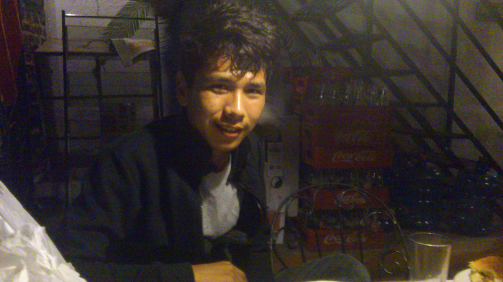

# Personal-Website-HTML
<!DOCTYPE html>
<html lang="en">
<head>
    <title>🖌️ Tenzing's Personal Website</title>
</head>
<body>
    <table cellspacing="20">
        <tr>
            <td>
                
            </td>
            <td>
                <h1> Tenzing Nyima</h1> 
                <p1> <em>Software Engineer</em></p1> 
                <p1> Hunter College Student </p1> 
                <p1> Majored in <strong>Computer Science</strong> and Creative Writing</p1> 
                <p1> I am a student at Hunter College from kathmandu, Nepal. I aspire to be a software engineer. I am very pasionate about</p1> 
                <p1> software engineering. As a child I never thought I was capeable of becomming an engineer and yet I am here so close to my dreams</p1> 
                <p1>I love problem sovling and the sense of confidence it gives me.</p1> 
                <p1><a href="contact.html">Contact Details</a></p1>
            </td>
        </tr>
    </table>

    
    
    

    <h2> Projects </h2>
    <p1> <ul>
        <li><strong><a href=" https://github.com/tnyima19/CountyDownty-2">CountyDownty</a></strong></li>
        <p1> This is an Ios app based game which generates random letters. The user must can type the longest word they can find within one minute.</p1>
        <p1> The points app checks if the word exists in the dictionary and gives points accordingly</p1>
        <p1> The points and the words are saved in the main page of the app.</p1> 
        <li><strong><a href="https://github.com/tnyima19/Simulate-Operating-System">Operating System Simulation</a></strong></li>
        <p1> This is a C++ project which simulates an operating system and how it communicates with other components in the computer</p1> 
        <p1> How it communicates with CPU, RAM, CPU scheduling Unit, Disk</p1>
    </ul></p1> 
    

    <h2><a href="hobbies.html">Hobbies</a></h2>
    <ol>
        <li>Soccer</li>
        <li>Painting</li>
        <li>Reading</li>
    </ol>
    <h2><a href="resume.html"> Resume</a></h2>
    

    <h2>Skills</h2>
    
        
            
                <table cellspacing="20">
                    <tr>
                        <td>C++</td>
                        <td>⭐⭐⭐⭐</td>
                        <td>
                            <p1>Painting</p1>
                        </td>
                        <td>
                            <p1>⭐⭐⭐</p1>
                        </td>
                    </tr>
                    <tr>
                        <td>iOS Development</td>
                        <td>⭐⭐⭐</td>
                        <td>Photography</td>
                        <td>⭐⭐</td>
                    </tr>
                    <tr>
                        <td>Web Development</td>
                        <td>⭐⭐⭐</td>
                    </tr>
                </table>
            
    
        

   
    
    
</body>
</html>
